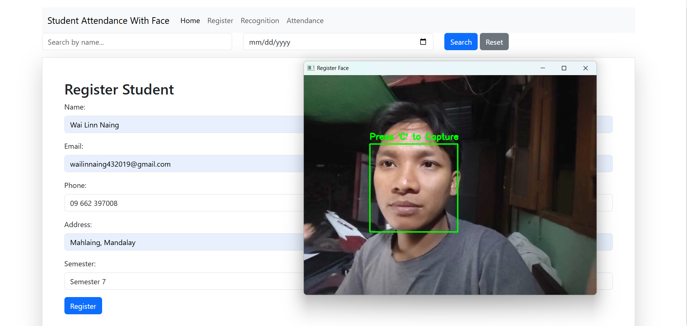
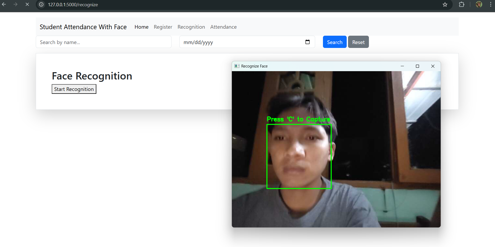

# 🏫 Student Attendance System with Facial Recognition

## A real-time attendance system using Flask, DeepFace, MySQL, and OpenCV, designed for student check-in/out with face recognition.

# 📌 Features

### ✅ Face Registration – Prevents duplicate registrations

### ✅ Real-time Face Recognition – Uses DeepFace for accurate matching

### ✅ Live Camera Feed – Detect & recognize faces instantly

### ✅ Attendance Tracking – Check-in/out system (first entry = check-in, second entry = check-out)

### ✅ Admin Panel – Modify student info, view attendance reports

### ✅ Dashboard – Shows attendance summary with filters

### ✅ Optimized Performance – Stores embeddings for faster recognition

# 🚀 Installation

## 1️⃣ Clone the Repository

### bash

### Copy

### Edit

### git clone https://github.com/wailinnaing432019/AttendanceWithFace

### cd AttendanceWithFace

## 2️⃣ Install Dependencies

### bash

### Copy

### Edit

### pip install -r requirements.txt

## 3️⃣ Configure MySQL Database

### Create a MySQL database

### Update config.py with your database credentials

## 4️⃣ Run the Flask App

### bash

### Copy

### Edit

### python app.py

### The app will be available at http://127.0.0.1:5000 🚀

# 🛠 Project Structure

### AttendanceWithFace/

### │── static/ # CSS, JS, and images

### │── templates/ # HTML files (UI)

### │── embeddings/ # Stored face embeddings for fast recognition

### │── app.py # Main Flask app

### │── config.py # Database & app configuration

### │── database.py # MySQL connection functions

### │── face_recognition.py # Face detection & DeepFace matching

### │── requirements.txt # Project dependencies

### │── README.md # Documentation

# 🖼 UI Screenshots

Here are some screenshots of the project in action:

### 🎯 Face Registration

### 🎯 Face Recognition

### 🎯 Attendance Dashboard

# 🛠 Technologies Used

## Flask – Web framework

DeepFace – Facial recognition

## OpenCV – Face detection

## MySQL – Database storage

## Mediapipe – Face tracking

📜 License
University of Computer Studies(Meikhtila) License
